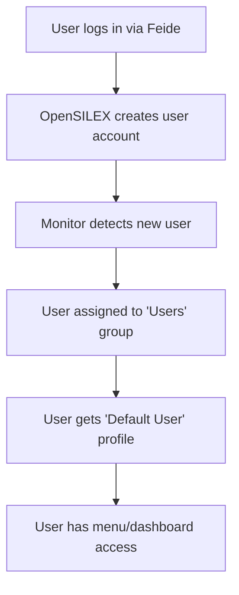

# OpenSILEX Automatic Group Assignment for Feide/OpenID Users

This document describes the automatic group assignment system for OpenSILEX installations using Feide/Dataporten OpenID Connect authentication.

## 🎯 Problem Solved

When users authenticate through Feide/Dataporten OpenID Connect, OpenSILEX automatically creates user accounts. However, by default these users have no group membership and therefore no permissions to access system features. This system automatically assigns new Feide users to a default group with appropriate permissions.

## 🏗️ System Architecture

### Components Installed

1. **Initial Setup Scripts** - Create required profiles and groups during installation
2. **Monitoring Service** - Continuously monitors for new users and assigns them to groups  
3. **Systemd Service** - Runs the monitor as a system service with automatic restart
4. **Logging & Rotation** - Complete logging system with automatic log rotation

### User Flow



## 🔧 Installation

The automatic group assignment system is **automatically installed** when you use the updated installation script:

```powershell
# Run the updated installation script
.\tools\opensilex-github.ps1 -Command FullInstall
```

### What Gets Installed

During installation, the system will:

1. **Wait for OpenSILEX to start** (up to 2 minutes)
2. **Install Python dependencies** (requests, pymongo, urllib3)
3. **Create monitoring scripts** in `/opt/opensilex-auto-groups/`
4. **Set up initial profiles and groups**:
   - `Default User` profile (limited permissions)
   - `Administrator` profile (full permissions)
   - `Users` group (for automatic assignment)
   - `Administrators` group (for manual assignment)
5. **Install systemd service** (`opensilex-auto-groups`)
6. **Configure logging** with rotation
7. **Start the monitoring service**

## 📋 User Management

### Profiles Created

#### Default User Profile
- **URI**: `http://opensilex.org/profiles/default`
- **Permissions**: 
  - `dashboard-access` - Can view dashboard
  - `menu-access` - Can access menus
  - `profile-read-own` - Can view their own profile
- **Purpose**: Limited access for regular Feide users

#### Administrator Profile  
- **URI**: `http://opensilex.org/profiles/admin`
- **Permissions**: Full system access (all credentials)
- **Purpose**: Complete access for system administrators

### Groups Created

#### Users Group (Automatic Assignment)
- **URI**: `http://opensilex.org/groups/users`
- **Members**: All new Feide users (automatic)
- **Profile**: Default User profile
- **Description**: "Default group for Feide/OpenID users - automatically assigned"

#### Administrators Group (Manual Assignment)
- **URI**: `http://opensilex.org/groups/administrators`  
- **Members**: Manually assigned admin users
- **Profile**: Administrator profile
- **Description**: "System administrators with full access"

## 🔄 How It Works

### Monitoring Process

1. **Service starts** when the system boots (or OpenSILEX service starts)
2. **Authenticates** with OpenSILEX API using admin credentials
3. **Checks for new users** every 60 seconds
4. **Compares** current users with previously processed users
5. **Assigns new users** to the default Users group with Default User profile
6. **Logs all activity** to `/var/log/opensilex-auto-groups.log`

### User Detection

The system tracks processed users in `/opt/opensilex-auto-groups/processed_users.json` to avoid duplicate assignments.

### Error Handling

- **Authentication failures**: Automatic retry with backoff
- **API errors**: Logged and retried on next cycle
- **Network issues**: Service automatically restarts (systemd)
- **Complete service failure**: Systemd auto-restarts after 10 seconds

## 🖥️ Management Commands

### Service Management
```bash
# Check service status
sudo systemctl status opensilex-auto-groups

# View real-time logs
sudo tail -f /var/log/opensilex-auto-groups.log  

# Restart the service
sudo systemctl restart opensilex-auto-groups

# Stop the service
sudo systemctl stop opensilex-auto-groups

# Start the service
sudo systemctl start opensilex-auto-groups

# View service logs from systemd
sudo journalctl -u opensilex-auto-groups -f
```

### Manual Group Assignment
```bash
# To make a user an administrator:
# 1. Log into OpenSILEX web interface as admin
# 2. Go to Administration > Groups
# 3. Edit "Administrators" group  
# 4. Add the user with "Administrator" profile
```

### Configuration Files
```bash
# Monitor script
/opt/opensilex-auto-groups/monitor_new_users.py

# Setup script  
/opt/opensilex-auto-groups/setup_initial_groups.py

# Processed users tracking
/opt/opensilex-auto-groups/processed_users.json

# Service configuration
/etc/systemd/system/opensilex-auto-groups.service

# Log rotation
/etc/logrotate.d/opensilex-auto-groups
```

## 🔍 Monitoring & Troubleshooting

### Normal Operation Logs
```
2025-08-26 10:30:15 - INFO - 🚀 Starting OpenSILEX New User Monitor for Feide/OpenID users
2025-08-26 10:30:15 - INFO - Successfully authenticated with OpenSILEX API
2025-08-26 10:31:20 - INFO - Found new user: john.doe@example.no (http://opensilex.org/users/123)
2025-08-26 10:31:21 - INFO - ✅ Assigned john.doe@example.no to default group
```

### Common Issues

#### Service Not Starting
```bash
# Check if OpenSILEX is running first
sudo systemctl status opensilex

# Check service dependencies
sudo systemctl status opensilex-auto-groups

# View detailed error logs
sudo journalctl -u opensilex-auto-groups --no-pager
```

#### Authentication Failures
```bash
# Check if admin user exists and has proper permissions
curl -X POST "http://localhost:8666/rest/security/authenticate" \
  -H "Content-Type: application/json" \
  -d '{"identifier":"admin@opensilex.org","password":"admin"}'

# Check OpenSILEX configuration
sudo cat /home/azureuser/opensilex/config/opensilex.yml | grep -A 10 security
```

#### Users Not Being Assigned
```bash
# Check if monitoring is running
sudo tail -f /var/log/opensilex-auto-groups.log

# Check processed users file
sudo cat /opt/opensilex-auto-groups/processed_users.json

# Manually test user detection
sudo -u root /opt/opensilex-auto-groups/venv/bin/python -c "
import sys
sys.path.append('/opt/opensilex-auto-groups')
from monitor_new_users import OpenSILEXAutoGroups
monitor = OpenSILEXAutoGroups()
monitor.authenticate()
users = monitor.get_users_from_api()
print(f'Found {len(users)} users')
"
```

## 🚀 New Installation Process

For **fresh installations** using the updated script:

1. **Run the installation**: `.\tools\opensilex-github.ps1 -Command FullInstall`
2. **Wait for completion** (~15-20 minutes total)
3. **Verify services are running**:
   ```bash
   ssh azureuser@YOUR_VM_IP
   sudo systemctl status opensilex
   sudo systemctl status opensilex-auto-groups
   ```
4. **Test Feide login**: 
   - Go to `http://YOUR_VM_IP/`
   - Click "Login with Feide"  
   - New users will automatically get default permissions

## 📊 Integration Summary

### Installation Script Updates
- **File**: `tools/opensilex-github.ps1`
- **Location**: After OpenSILEX service start, before completion message
- **Duration**: Adds ~2-3 minutes to installation time
- **Dependencies**: Python 3, pip, venv (installed automatically)

### System Integration
- **Service Dependencies**: Starts after `opensilex.service`
- **User**: Runs as root (required for system management)
- **Resources**: Minimal CPU/memory usage (checks every 60 seconds)
- **Storage**: ~50MB for Python environment and logs

### Security Considerations
- **Admin credentials**: Used only for API authentication
- **Token handling**: Tokens refreshed automatically
- **User privacy**: Only email addresses logged (no personal data)
- **Permissions**: New users get minimal access by default

## 🎯 Benefits

1. **Automatic**: Zero manual intervention required
2. **Secure**: New users get minimal permissions by default  
3. **Scalable**: Handles unlimited number of Feide users
4. **Reliable**: Service auto-restarts, comprehensive logging
5. **Maintainable**: Standard systemd service, log rotation
6. **Integrated**: Part of standard installation process

## 🔄 Upgrade Path

For **existing installations**, the auto-group system can be added by:

1. Re-running the installation script (safe on existing systems)
2. Or manually copying the relevant sections from the updated script

The system is designed to be **idempotent** - running it multiple times is safe and will not create duplicates.

---

**✅ Status**: Fully implemented and integrated into the installation process. Ready for production use with Feide/OpenID Connect authentication.