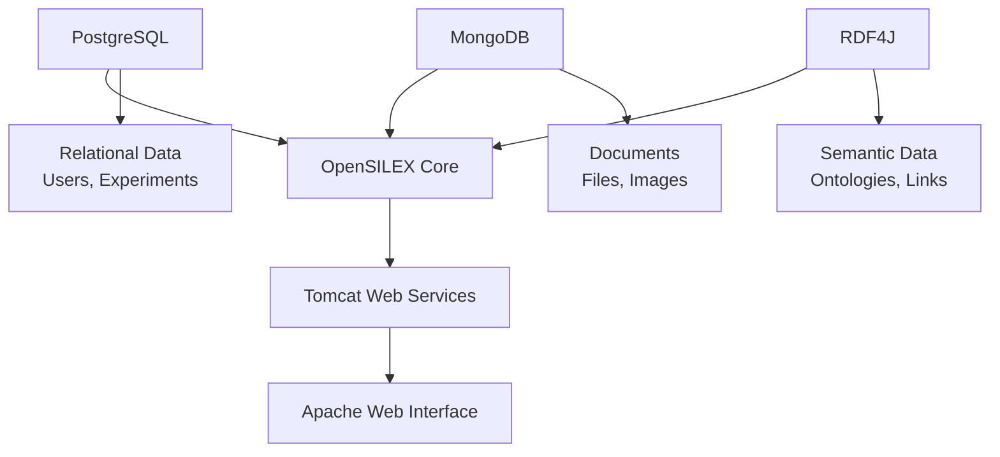

# OpenSILEX Database Configuration Guide

## Table of Contents
1. [Overview](#overview)
2. [PostgreSQL Configuration](#postgresql-configuration)
3. [MongoDB Configuration](#mongodb-configuration)
4. [RDF4J Configuration](#rdf4j-configuration)
5. [Database Relationships](#database-relationships)
6. [Production Planning](#production-planning)
7. [Security Configurations](#security-configurations)
8. [Backup and Maintenance](#backup-and-maintenance)
9. [Performance Optimization](#performance-optimization)
10. [Troubleshooting](#troubleshooting)

---

## Overview

OpenSILEX uses a **hybrid multi-database architecture** to handle different types of data:

- **PostgreSQL + PostGIS**: Relational and spatial data
- **MongoDB**: Document storage and file management (GridFS)
- **RDF4J**: Semantic web and triple store for linked data

### System Requirements

**Minimum Production Specifications:**
- **CPU**: 4 cores (2.30GHz+)
- **RAM**: 32 GB (critical for RDF4J performance)
- **Storage**: 500 GB SSD (with expansion capability)
- **Network**: Stable Ethernet connection

---

## PostgreSQL Configuration

### Installation and Setup

#### Basic Installation
```bash
# Ubuntu/Debian
sudo apt update
sudo apt install postgresql-13 postgresql-contrib postgis

# CentOS/RHEL
sudo yum install postgresql13-server postgresql13-contrib postgis33_13
```

#### Database Creation
```sql
-- Create OpenSILEX user
CREATE USER opensilex;
ALTER ROLE opensilex WITH CREATEDB;
ALTER ROLE opensilex WITH SUPERUSER;
ALTER USER opensilex WITH ENCRYPTED PASSWORD 'your_secure_password';

-- Create database
CREATE DATABASE opensilex_production OWNER opensilex;

-- Connect to database and enable PostGIS
\c opensilex_production;
CREATE EXTENSION IF NOT EXISTS postgis;
CREATE EXTENSION IF NOT EXISTS postgis_topology;
```

#### Initial Data Import
```bash
# Import initial schema/data
psql -U opensilex -h 127.0.0.1 opensilex_production < /path/to/opensilex_dump.sql
```

### Configuration Parameters

#### postgresql.conf Settings
```ini
# Memory settings
shared_buffers = 8GB                    # 25% of total RAM
effective_cache_size = 24GB             # 75% of total RAM
maintenance_work_mem = 2GB              # For VACUUM, CREATE INDEX
work_mem = 256MB                        # Per query operation

# Connection settings
max_connections = 200                   # Adjust based on application needs
shared_preload_libraries = 'postgis-3'

# WAL settings (for backup/replication)
wal_level = replica
archive_mode = on
archive_command = 'cp %p /var/lib/postgresql/archive/%f'
max_wal_senders = 3
```

#### pg_hba.conf Security
```ini
# TYPE  DATABASE        USER            ADDRESS                 METHOD
local   all             postgres                                peer
local   all             all                                     md5
host    all             all             127.0.0.1/32            md5
host    all             all             ::1/128                 md5
host    opensilex_production opensilex  10.0.0.0/8             md5
```

### PostGIS Spatial Features

#### Spatial Data Types
```sql
-- Geometry columns for spatial data
ALTER TABLE experiments ADD COLUMN geom geometry(POINT, 4326);
ALTER TABLE plots ADD COLUMN boundary geometry(POLYGON, 4326);

-- Spatial indexes
CREATE INDEX idx_experiments_geom ON experiments USING GIST(geom);
CREATE INDEX idx_plots_boundary ON plots USING GIST(boundary);
```

#### Common Spatial Queries
```sql
-- Find experiments within 1km radius
SELECT * FROM experiments 
WHERE ST_DWithin(geom, ST_MakePoint(2.3488, 48.8534), 1000);

-- Calculate area of plots
SELECT plot_id, ST_Area(boundary::geography) as area_m2 FROM plots;
```

---

## MongoDB Configuration

### Installation and Setup

#### Installation
```bash
# Import MongoDB GPG key
wget -qO - https://www.mongodb.org/static/pgp/server-4.4.asc | sudo apt-key add -

# Add repository
echo "deb [ arch=amd64,arm64 ] https://repo.mongodb.org/apt/ubuntu focal/mongodb-org/4.4 multiverse" | sudo tee /etc/apt/sources.list.d/mongodb-org-4.4.list

# Install MongoDB
sudo apt update
sudo apt install -y mongodb-org
```

#### Replica Set Configuration (Required for Transactions)
```yaml
# /etc/mongod.conf
storage:
  dbPath: /var/lib/mongodb
  journal:
    enabled: true
  wiredTiger:
    engineConfig:
      cacheSizeGB: 16
    collectionConfig:
      blockCompressor: snappy

systemLog:
  destination: file
  logAppend: true
  path: /var/log/mongodb/mongod.log

net:
  port: 27017
  bindIp: 127.0.0.1

replication:
  replSetName: "opensilex-rs"

security:
  authorization: enabled
```

#### Initialize Replica Set
```javascript
// Connect to MongoDB
mongo

// Initialize replica set
rs.initiate({
  _id: "opensilex-rs",
  members: [
    { _id: 0, host: "localhost:27017" }
  ]
});

// Wait for primary election
rs.status();
```

#### User Creation
```javascript
// Switch to admin database
use admin;

// Create admin user
db.createUser({
  user: "admin",
  pwd: "secure_admin_password",
  roles: ["userAdminAnyDatabase", "dbAdminAnyDatabase", "readWriteAnyDatabase"]
});

// Create OpenSILEX database user
use opensilex;
db.createUser({
  user: "opensilex",
  pwd: "secure_opensilex_password",
  roles: [
    { role: "readWrite", db: "opensilex" },
    { role: "dbAdmin", db: "opensilex" }
  ]
});
```

### GridFS Configuration

#### File Storage Setup
```javascript
// Configure GridFS for file storage
use opensilex;

// Create GridFS collections with indexes
db.fs.chunks.createIndex({ files_id: 1, n: 1 });
db.fs.files.createIndex({ filename: 1 });
db.fs.files.createIndex({ uploadDate: 1 });
```

#### Document Collections
```javascript
// Common OpenSILEX collections
db.createCollection("experiments");
db.createCollection("devices");
db.createCollection("data");
db.createCollection("users");

// Create indexes for performance
db.experiments.createIndex({ "uri": 1 });
db.devices.createIndex({ "type": 1, "status": 1 });
db.data.createIndex({ "date": 1, "variable": 1 });
```

---

## RDF4J Configuration

### Installation and Setup

#### Docker Installation (Recommended)
```yaml
# docker-compose.yml
version: '3.8'
services:
  rdf4j:
    image: eclipse/rdf4j-workbench:4.3.3
    ports:
      - "8080:8080"
    environment:
      - JAVA_OPTS=-Xms4g -Xmx16g -XX:+UseG1GC
    volumes:
      - rdf4j-data:/var/rdf4j
      - rdf4j-logs:/usr/local/tomcat/logs
    restart: unless-stopped

volumes:
  rdf4j-data:
  rdf4j-logs:
```

#### Manual Installation
```bash
# Download RDF4J
wget https://github.com/eclipse/rdf4j/releases/download/4.3.3/eclipse-rdf4j-4.3.3-sdk.zip
unzip eclipse-rdf4j-4.3.3-sdk.zip

# Deploy to Tomcat
cp eclipse-rdf4j-4.3.3/war/*.war /opt/tomcat/webapps/
```

### Repository Configuration

#### Create OpenSILEX Repository
```turtle
# Repository configuration (config.ttl)
@prefix rdfs: <http://www.w3.org/2000/01/rdf-schema#> .
@prefix rep: <http://www.openrdf.org/config/repository#> .
@prefix sr: <http://www.openrdf.org/config/repository/sail#> .
@prefix sail: <http://www.openrdf.org/config/sail#> .
@prefix ms: <http://www.openrdf.org/config/sail/memory#> .

[] a rep:Repository ;
   rep:repositoryID "opensilex" ;
   rdfs:label "OpenSILEX Repository" ;
   rep:repositoryImpl [
      rep:repositoryType "openrdf:SailRepository" ;
      sr:sailImpl [
         sail:sailType "openrdf:NativeStore" ;
         ms:persist true ;
         ms:syncDelay 120
      ]
   ] .
```

#### API Configuration
```bash
# Create repository via REST API
curl -X PUT "http://localhost:8080/rdf4j-server/repositories/opensilex" \
  -H "Content-Type: application/x-turtle" \
  --data-raw '@prefix rdfs: <http://www.w3.org/2000/01/rdf-schema#> .
@prefix rep: <http://www.openrdf.org/config/repository#> .
@prefix sr: <http://www.openrdf.org/config/repository/sail#> .
@prefix sail: <http://www.openrdf.org/config/sail#> .
@prefix ms: <http://www.openrdf.org/config/sail/memory#> .

[] a rep:Repository ;
   rep:repositoryID "opensilex" ;
   rdfs:label "OpenSILEX Repository" ;
   rep:repositoryImpl [
      rep:repositoryType "openrdf:SailRepository" ;
      sr:sailImpl [
         sail:sailType "openrdf:NativeStore" ;
         ms:persist true ;
         ms:syncDelay 120
      ]
   ] .'
```

### Ontology Management

#### Required Ontologies
```sparql
# Import OESO (Ontology for Experimental System Observation)
LOAD <http://www.opensilex.org/vocabulary/oeso> INTO GRAPH <http://www.opensilex.org/vocabulary/oeso>

# Import OEEV (Ontology for Environmental Variables)
LOAD <http://www.opensilex.org/vocabulary/oeev> INTO GRAPH <http://www.opensilex.org/vocabulary/oeev>

# Import OA (Open Annotation)
LOAD <http://www.w3.org/ns/oa#> INTO GRAPH <http://www.w3.org/ns/oa>
```

#### SPARQL Queries Examples
```sparql
# Get all experiments
PREFIX oeso: <http://www.opensilex.org/vocabulary/oeso#>
SELECT ?experiment ?label WHERE {
  ?experiment a oeso:Experiment .
  ?experiment rdfs:label ?label .
}

# Get experimental data
PREFIX oeso: <http://www.opensilex.org/vocabulary/oeso#>
SELECT ?variable ?value ?date WHERE {
  ?data oeso:hasVariable ?variable .
  ?data oeso:hasValue ?value .
  ?data oeso:hasDate ?date .
}
```

---

## Database Relationships

### Service Dependencies



### Startup Sequence

1. **Database Layer**: PostgreSQL → MongoDB → RDF4J
2. **Application Layer**: Tomcat (Java services)
3. **Web Layer**: Apache (PHP frontend)

### Configuration File Relationships

```yaml
Primary Config Files:
  - opensilex.yml          # Main application configuration
  - service.properties     # Web service settings
  - /etc/mongod.conf      # MongoDB configuration
  - postgresql.conf       # PostgreSQL settings
  - config.ttl           # RDF4J repository config
```

---

## Production Planning

### Capacity Planning

#### Database Storage Estimates

| Component | Data Type | Storage Growth |
|-----------|-----------|----------------|
| PostgreSQL | Structured data | 10-50 MB/month |
| MongoDB | Documents/Files | 1-10 GB/month |
| RDF4J | Semantic triples | 100-500 MB/month |

#### Memory Allocation

```yaml
Total 32GB RAM Allocation:
  PostgreSQL: 12GB (shared_buffers + cache)
  MongoDB: 16GB (WiredTiger cache)
  RDF4J: 16GB (JVM heap)
  System: 4GB (OS + other processes)
  
Note: MongoDB and RDF4J can share memory through OS page cache
```

### Scaling Strategies

#### Horizontal Scaling
```yaml
PostgreSQL:
  - Read replicas for reporting
  - Connection pooling (PgBouncer)
  - Partitioning large tables

MongoDB:
  - Replica sets (3+ nodes)
  - Sharding for large collections
  - GridFS optimization

RDF4J:
  - Multiple repositories
  - Query result caching
  - SPARQL endpoint clustering
```

#### Vertical Scaling
```yaml
CPU Scaling:
  - More cores for concurrent queries
  - Faster single-core for complex operations

Memory Scaling:
  - Critical for RDF4J reasoning
  - Improves PostgreSQL query performance
  - Reduces MongoDB disk I/O

Storage Scaling:
  - NVMe SSDs for high IOPS
  - Network attached storage for capacity
```

---

## Security Configurations

### Database Security

#### PostgreSQL Security
```ini
# postgresql.conf
ssl = on
ssl_cert_file = 'server.crt'
ssl_key_file = 'server.key'
password_encryption = scram-sha-256

# Connection security
listen_addresses = '127.0.0.1,10.0.0.0/8'
max_connections = 200
```

```sql
-- Row Level Security
CREATE POLICY user_experiments ON experiments
  USING (created_by = current_user);

ALTER TABLE experiments ENABLE ROW LEVEL SECURITY;
```

#### MongoDB Security
```yaml
# mongod.conf
security:
  authorization: enabled
  enableEncryption: true
  encryptionKeyFile: /etc/mongodb-keyfile

net:
  ssl:
    mode: requireSSL
    PEMKeyFile: /etc/ssl/mongodb.pem
    CAFile: /etc/ssl/ca.pem
```

#### RDF4J Security
```xml
<!-- web.xml -->
<security-constraint>
  <web-resource-collection>
    <web-resource-name>RDF4J</web-resource-name>
    <url-pattern>/*</url-pattern>
  </web-resource-collection>
  <auth-constraint>
    <role-name>rdf4j-user</role-name>
  </auth-constraint>
</security-constraint>
```

### Network Security

```yaml
Firewall Configuration:
  PostgreSQL:
    - Port: 5432
    - Allow: Application servers only
    - Block: External access
    
  MongoDB:
    - Port: 27017
    - Allow: Replica set members
    - Block: External access
    
  RDF4J:
    - Port: 8080
    - Allow: Application access
    - Proxy: Through reverse proxy only
```

---

## Backup and Maintenance

### Backup Strategies

#### PostgreSQL Backups
```bash
#!/bin/bash
# Daily backup script

DATE=$(date +%Y%m%d_%H%M%S)
BACKUP_DIR="/backup/postgresql"
DB_NAME="opensilex_production"

# Full database backup
pg_dump -U opensilex -h localhost $DB_NAME | gzip > $BACKUP_DIR/full_$DATE.sql.gz

# Point-in-time recovery setup
rsync -av /var/lib/postgresql/archive/ $BACKUP_DIR/wal_archive/

# Cleanup old backups (keep 30 days)
find $BACKUP_DIR -name "*.sql.gz" -mtime +30 -delete
```

#### MongoDB Backups
```bash
#!/bin/bash
# MongoDB replica set backup

DATE=$(date +%Y%m%d_%H%M%S)
BACKUP_DIR="/backup/mongodb"

# Database dump
mongodump --host opensilex-rs/localhost:27017 --out $BACKUP_DIR/$DATE

# GridFS backup
mongofiles --host localhost --db opensilex --local $BACKUP_DIR/gridfs_$DATE list

# Compress backup
tar -czf $BACKUP_DIR/mongodb_$DATE.tar.gz $BACKUP_DIR/$DATE
rm -rf $BACKUP_DIR/$DATE

# Cleanup old backups
find $BACKUP_DIR -name "*.tar.gz" -mtime +14 -delete
```

#### RDF4J Backups
```bash
#!/bin/bash
# RDF4J repository backup

DATE=$(date +%Y%m%d_%H%M%S)
BACKUP_DIR="/backup/rdf4j"
REPO="opensilex"

# Export all statements
curl -X GET "http://localhost:8080/rdf4j-server/repositories/$REPO/statements" \
  -H "Accept: application/n-triples" \
  -o $BACKUP_DIR/repository_$DATE.nt

# Compress backup
gzip $BACKUP_DIR/repository_$DATE.nt

# Cleanup old backups
find $BACKUP_DIR -name "*.nt.gz" -mtime +30 -delete
```

### Maintenance Tasks

#### Daily Tasks
```bash
#!/bin/bash
# Daily maintenance script

# Check database connections
pg_stat_activity | grep opensilex
mongo --eval "db.adminCommand('connPoolStats')"

# Check RDF4J status
curl -s http://localhost:8080/rdf4j-server/protocol

# Rotate logs
logrotate /etc/logrotate.d/postgresql
logrotate /etc/logrotate.d/mongodb

# Monitor disk space
df -h | grep -E "(postgresql|mongodb|rdf4j)"
```

#### Weekly Tasks
```bash
#!/bin/bash
# Weekly maintenance script

# PostgreSQL maintenance
psql -U opensilex -d opensilex_production -c "VACUUM ANALYZE;"
psql -U opensilex -d opensilex_production -c "REINDEX DATABASE opensilex_production;"

# MongoDB maintenance
mongo opensilex --eval "db.runCommand({compact: 'experiments'})"
mongo opensilex --eval "db.stats()"

# RDF4J optimization
# Repository optimization (run during low usage)
curl -X POST "http://localhost:8080/rdf4j-server/repositories/opensilex/optimization"
```

---

## Performance Optimization

### PostgreSQL Optimization

#### Configuration Tuning
```ini
# postgresql.conf - Performance settings
shared_buffers = 8GB
effective_cache_size = 24GB
maintenance_work_mem = 2GB
work_mem = 256MB
random_page_cost = 1.1  # For SSD storage
effective_io_concurrency = 200

# Query planner
default_statistics_target = 100
constraint_exclusion = partition

# Write-ahead log
wal_buffers = 16MB
checkpoint_completion_target = 0.7
checkpoint_timeout = 10min
```

#### Index Optimization
```sql
-- Analyze query performance
EXPLAIN ANALYZE SELECT * FROM experiments WHERE status = 'active';

-- Create optimal indexes
CREATE INDEX CONCURRENTLY idx_experiments_status_date 
ON experiments(status, created_date) WHERE status = 'active';

-- Partial indexes for common queries
CREATE INDEX idx_active_experiments ON experiments(created_date) 
WHERE status = 'active';

-- Monitor index usage
SELECT schemaname, tablename, attname, n_distinct, correlation
FROM pg_stats WHERE tablename = 'experiments';
```

### MongoDB Optimization

#### Configuration Tuning
```yaml
# mongod.conf - Performance settings
storage:
  wiredTiger:
    engineConfig:
      cacheSizeGB: 16
      directoryForIndexes: true
    collectionConfig:
      blockCompressor: snappy
    indexConfig:
      prefixCompression: true

operationProfiling:
  mode: slowOp
  slowOpThresholdMs: 100

net:
  compression:
    compressors: snappy,zstd
```

#### Query Optimization
```javascript
// Create compound indexes
db.experiments.createIndex({ "status": 1, "date": 1, "type": 1 });

// Use aggregation pipeline for complex queries
db.experiments.aggregate([
  { $match: { status: "active" } },
  { $group: { _id: "$type", count: { $sum: 1 } } },
  { $sort: { count: -1 } }
]);

// Monitor query performance
db.setProfilingLevel(2, { slowms: 100 });
db.system.profile.find().limit(5).sort({ ts: -1 }).pretty();
```

### RDF4J Optimization

#### JVM Configuration
```bash
# JAVA_OPTS for RDF4J
export JAVA_OPTS="-Xms8g -Xmx16g \
  -XX:+UseG1GC \
  -XX:MaxGCPauseMillis=200 \
  -XX:+UseStringDeduplication \
  -XX:+OptimizeStringConcat"
```

#### Query Optimization
```sparql
-- Use LIMIT for large result sets
PREFIX oeso: <http://www.opensilex.org/vocabulary/oeso#>
SELECT ?experiment ?label WHERE {
  ?experiment a oeso:Experiment .
  ?experiment rdfs:label ?label .
  FILTER(CONTAINS(LCASE(?label), "wheat"))
} LIMIT 100

-- Use indexes with specific patterns
SELECT ?s ?p ?o WHERE {
  ?s ?p ?o .
  ?s a oeso:Experiment .
} ORDER BY ?s
```

---

## Troubleshooting

### Common Issues

#### PostgreSQL Issues

**Connection Problems:**
```bash
# Check if PostgreSQL is running
sudo systemctl status postgresql

# Check connections
sudo -u postgres psql -c "SELECT * FROM pg_stat_activity;"

# Connection limit reached
ALTER SYSTEM SET max_connections = 300;
SELECT pg_reload_conf();
```

**Performance Issues:**
```sql
-- Find slow queries
SELECT query, mean_time, calls 
FROM pg_stat_statements 
ORDER BY mean_time DESC LIMIT 10;

-- Check locks
SELECT * FROM pg_locks WHERE NOT granted;

-- Analyze table statistics
ANALYZE VERBOSE table_name;
```

#### MongoDB Issues

**Replica Set Problems:**
```javascript
// Check replica set status
rs.status();

// Reconfigure replica set
rs.reconfig({
  _id: "opensilex-rs",
  members: [
    { _id: 0, host: "localhost:27017" }
  ]
});
```

**Performance Issues:**
```javascript
// Check current operations
db.currentOp();

// Kill slow operations
db.killOp(opid);

// Check index usage
db.experiments.getIndexes();
db.experiments.explain().find({status: "active"});
```

#### RDF4J Issues

**Memory Problems:**
```bash
# Check JVM memory usage
jstat -gc <pid>

# Increase heap size
export JAVA_OPTS="-Xmx20g"

# Check repository size
curl "http://localhost:8080/rdf4j-server/repositories/opensilex/size"
```

**Query Timeouts:**
```xml
<!-- Increase query timeout -->
<context-param>
  <param-name>org.eclipse.rdf4j.query.timeout</param-name>
  <param-value>300</param-value>
</context-param>
```

### Monitoring and Alerts

#### System Monitoring
```bash
#!/bin/bash
# Monitoring script

# Database sizes
echo "PostgreSQL size:"
psql -U opensilex -d opensilex_production -c "SELECT pg_size_pretty(pg_database_size('opensilex_production'));"

echo "MongoDB size:"
mongo opensilex --eval "printjson(db.stats())"

echo "RDF4J size:"
curl -s "http://localhost:8080/rdf4j-server/repositories/opensilex/size"

# Performance metrics
echo "Active connections:"
psql -U opensilex -d opensilex_production -c "SELECT count(*) FROM pg_stat_activity;"

echo "MongoDB operations:"
mongo --eval "db.serverStatus().opcounters"

echo "Memory usage:"
free -h
```

#### Log Analysis
```bash
# PostgreSQL logs
tail -f /var/log/postgresql/postgresql-13-main.log | grep ERROR

# MongoDB logs
tail -f /var/log/mongodb/mongod.log | grep -i error

# RDF4J logs
tail -f /opt/tomcat/logs/catalina.out | grep "rdf4j"
```

---

## Conclusion

This comprehensive guide covers all aspects of OpenSILEX database configuration and management. Key takeaways:

1. **Multi-database Architecture**: Each database serves specific purposes and requires dedicated configuration
2. **Security First**: Implement proper authentication, encryption, and network security
3. **Performance Monitoring**: Regular monitoring and optimization are essential
4. **Backup Strategy**: Comprehensive backup procedures for all three databases
5. **Scalability Planning**: Design for growth from the beginning

For production deployments, always test configurations in a staging environment before applying to production systems.